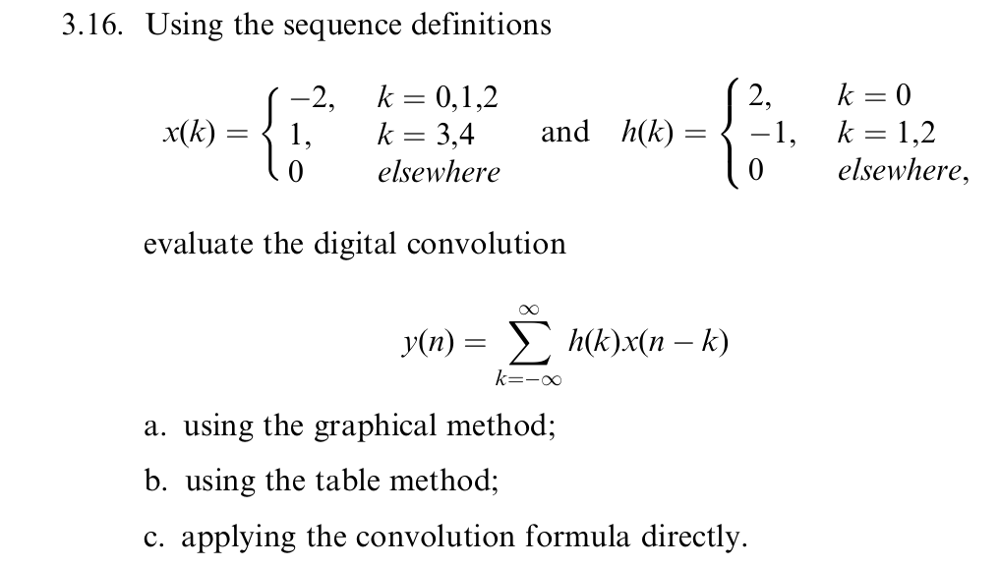
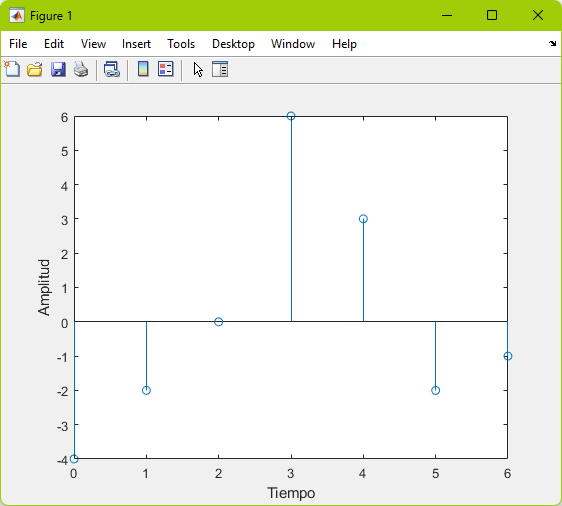
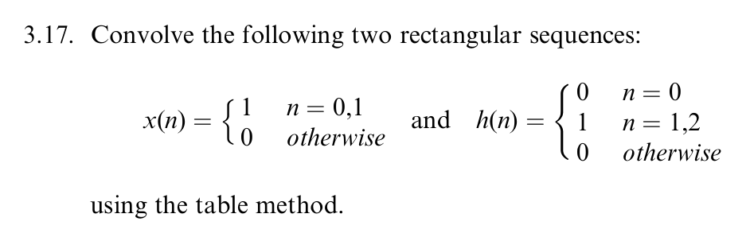
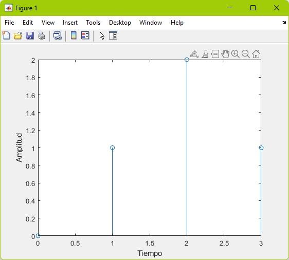
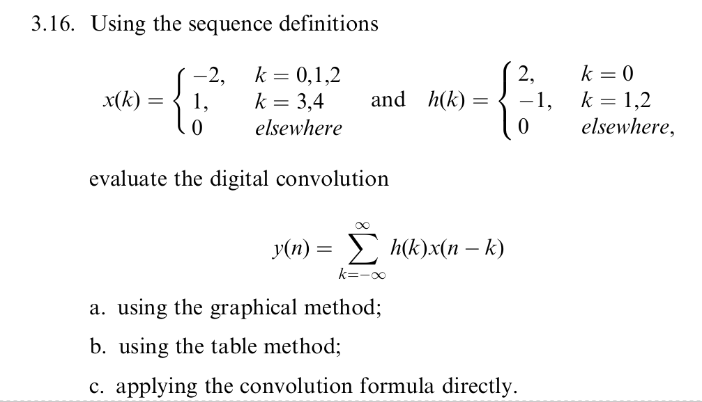
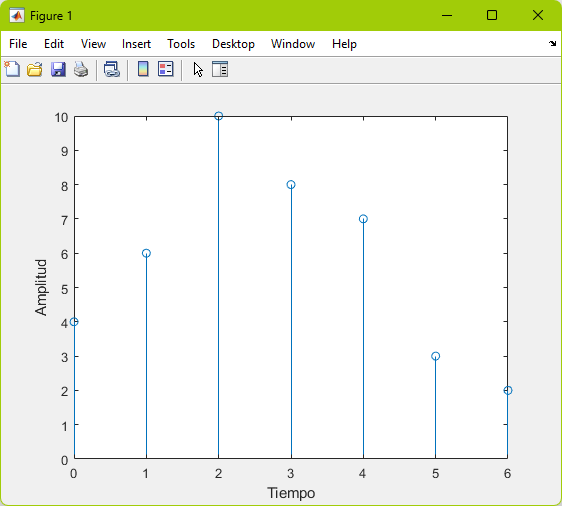

# Convolución 

## Definición

En matemáticas, y en particular análisis funcional, una convolución es un operador matemático que transforma dos funciones _f_ y _g_ en una tercera función que en cierto sentido representa la magnitud en la que se superponen _f_ y una versión trasladada e invertida de _g_. Una convolución es un tipo muy general de medida móvil, como se puede observar si una de las funciones se toma como la función característica de un intervalo. La convolución de _f_ y _g_ se denota __f * g__. Se define como la integral del producto de ambas funciones después de desplazar una de ellas una distancia _t_. La convolución y las operaciones relacionadas se encuentran en muchas aplicaciones de ingeniería y matemáticas.

Cuando se trata de hacer un procesamiento digital de señal no tiene sentido hablar de convoluciones aplicando estrictamente la definición ya que solo se dispone de valores en instantes discretos de tiempo. Es necesaria una aproximación numérica.

## Ejercicio 1




### Codigo en MATLAB

```matlab
%Ejercicio 1
x = [-2 -2 -2 1 1];
h = [2 -1 -1];
y = conv(x,h);
k1 = length(y);
k = [0:1:k1-1];
stem(k,y);
xlabel("Tiempo");
ylabel("Amplitud");
```

### Grafica en MATLAB



## Ejercicio 2



### Codigo MATLAB

```matlab
%Ejercicio 2 
x = [1 1];
h = [0 1 1];
y = conv(x,h);
k1 = length(y);
k = [0:1:k1-1];
stem(k,y);
xlabel("Tiempo");
ylabel("Amplitud");
```

### Grafica en MATLAB




## Ejercicio 3




### Codigo de MATLAB

```matlab
%Ejercicio 3 
x = [2 1 2];
h = [2 2 2 1 1];
y = conv(x,h);
k1 = length(y);
k = [0:1:k1-1];
stem(k,y);
xlabel("Tiempo");
ylabel("Amplitud");
```

### Grafica en MATLAB




## Referencias

- Ecolaboradores de Wikipedia. (2023). Convolución. Wikipedia, La Enciclopedia Libre. https://es.wikipedia.org/wiki/Convoluci%C3%B3n 


## Codigo Verilog

```verilog
module divisor50mhz(

	input					clk_i, //señal de entrada para el reloj
	input					rst_ni,//señal de reset
	output	reg		clk1hz_o	//salida del la señal de reloj
	
);

	reg 		[31:0]	ctr_w;//variable de regristo para contar el numero de ciclos del reloj
	
	always @(posedge clk_i, negedge rst_ni)//bloque always se ejecuta con la señal positiva del reloj y en la señal negativa de reinicio del reset
	begin
		if(!rst_ni)// bloque de reinicio 
			begin
				ctr_w 	= 32'b0;// contador se pone en cero
				clk1hz_o = 1'b1;// señal de salida en alto
			end
		else 
			if(ctr_w == 32'd50_000_000)//comprobamos si alcanzo el valor de 50MHz
				begin
					ctr_w = 32'b0;//contador se pone en 0
					clk1hz_o = ~clk1hz_o;//invertimos la señal de salid
				end
			else
				begin
					ctr_w = ctr_w + 1'b1;// incremento del contador hasta que llegue a 50MHz
				end
	end
endmodule 
```