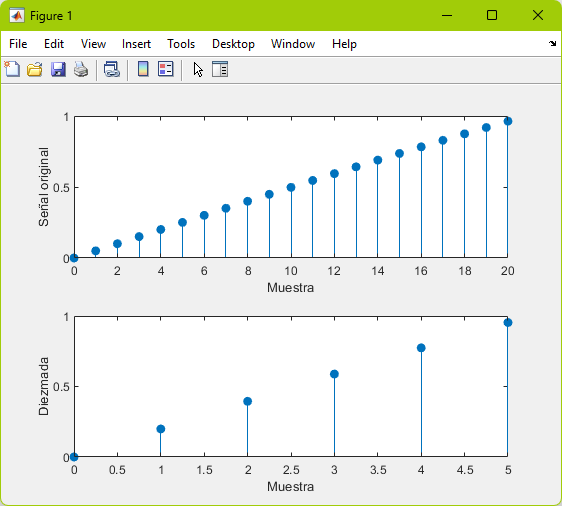

# Diezmado

## Definición

En el procesamiento de señal digital, __submuestreo__, __compresión__ y __diezmado__ son términos asociados con el proceso de remuestreo en un sistema de procesamiento de señal digital de velocidad múltiple. Tanto el submuestreo como el diezmado pueden ser sinónimos de compresión, o pueden describir un proceso completo de reducción de ancho de banda (_filtrado_) y reducción de la frecuencia de muestreo. Cuando el proceso se realiza en una secuencia de muestras de una señal u otra función continua, produce una aproximación de la secuencia que se habría obtenido al muestrear la señal a una velocidad menor.

Diezmado es un término que históricamente significa la extracción de cada décima parte. Pero en procesamiento de señal, significa mantener solo la décima muestra. Este factor multiplica el intervalo de muestreo o, de manera equivalente, divide la frecuencia de muestreo. Por ejemplo, si el audio de un disco compacto, procesado a razón de 44 100 muestras/segundo, es diezmado en un factor de 5/4, la frecuencia de muestreo resultante es de 35 280. Un componente del sistema que realiza el diezmado se denomina diezmador. El diezmado por un factor entero también se llama compresión.

## Codigo MATLAB

```matlab
%Diezmado
t = 0:1/1e3:1;
x = 2*sin(8*pi*t);
y = decimate(x, 4);

subplot(2, 1, 1);
stem(0:20, x(1:21), "filled");
xlabel("Muestra");
ylabel("Señal original");


subplot(2, 1, 2);
stem(0:5, y(1:6), "filled");
xlabel("Muestra");
ylabel("Diezmada");

```

## Grafica



## Referencias

- colaboradores de Wikipedia. (2023b). Submuestreo. Wikipedia, La Enciclopedia Libre. https://es.wikipedia.org/wiki/Submuestreo