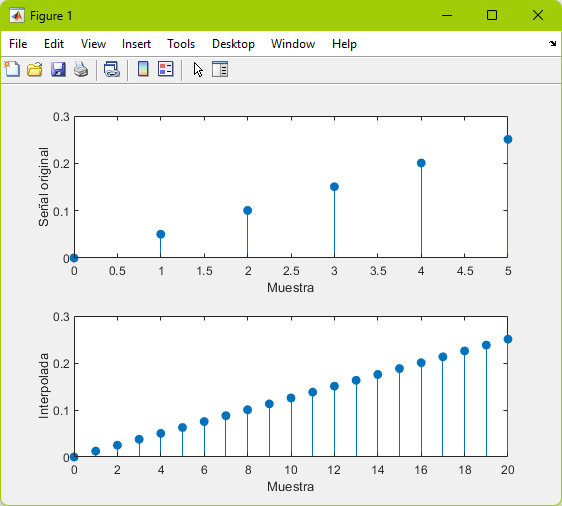

# Interpolación 

## Definición

La reconstrucción, también conocida como interpolación, intenta realizar un proceso opuesto que produce una señal de tiempo continua coincidiendo con los puntos de la señal de tiempo discreta. Debido a que el proceso de muestreo para conjuntos generales de señales no es invertible, existen numerosas reconstrucciones posibles a partir de una señal de tiempo discreta dada, cada una de las cuales muestran esa señal a la velocidad de muestreo apropiada.

El proceso de interpolación produce una señal de tiempo continua que muestrea a una señal de tiempo discreta dada a una frecuencia de muestreo específica. La reconstrucción se puede entender matemáticamente generando primero un tren de impulsos de tiempo continuo a partir de una señal muestreada Xs con periodo de muestreo Ts y luego aplicar un filtro de paso bajo G que satisfaga ciertas condiciones para producir una señal de salida X.

## Codigo MATLAB

```matlab
%Interpolacion
t = 0:1/1e3:1;
x = 2*sin(8*pi*t);
y = interp(x, 4);

subplot(2, 1, 1);
stem(0:5, x(1:6), "filled");
xlabel("Muestra");
ylabel("Señal original");

subplot(2, 1, 2);
stem(0:20, y(1:21), "filled");
xlabel("Muestra");
ylabel("Interpolada");
```

## Grafica MATLAB



## Referencias
- Libretexts. (2022). 10.3: Reconstrucción de señal. LibreTexts Español. https://espanol.libretexts.org/Ingenieria/Se%C3%B1ales_y_Sistemas_(Baraniuk_et_al.)/10%3A_Muestreo_y_Reconstrucci%C3%B3n/10.03%3A_Reconstrucci%C3%B3n_de_se%C3%B1al
